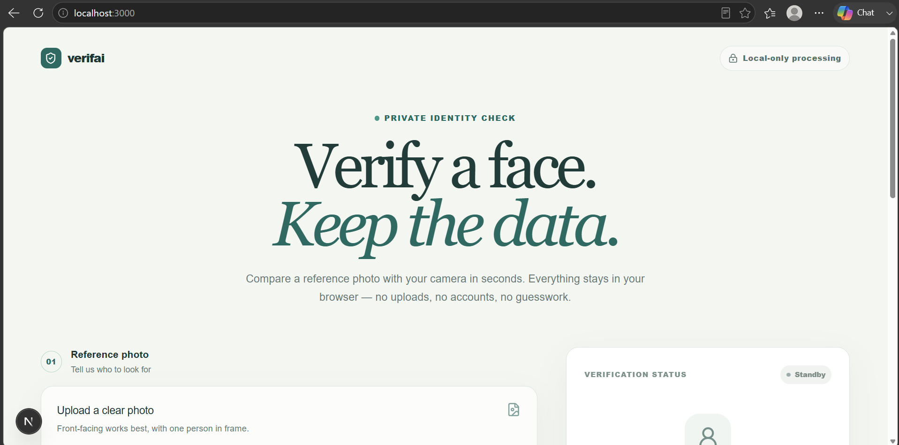
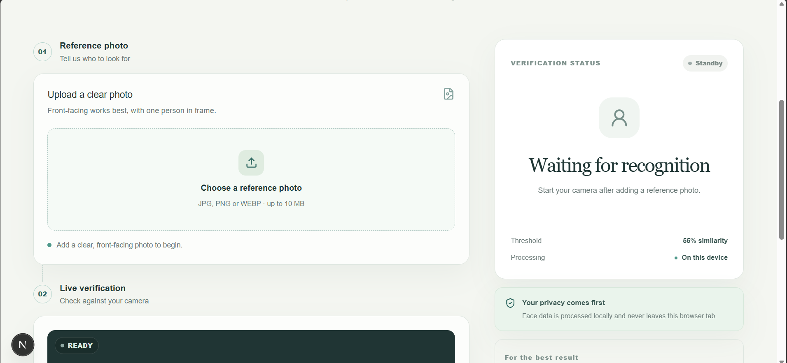
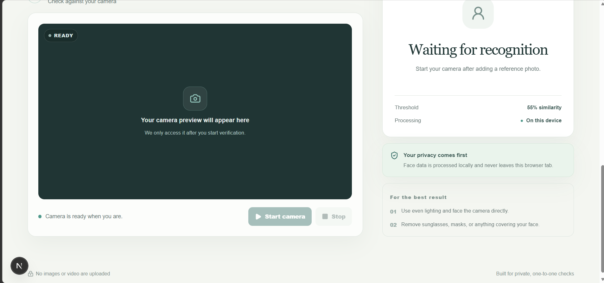

# Verifai — Private Face Verification

Verifai is a browser-based face verification tool. Upload a reference photo of a person, start your webcam, and Verifai checks the live camera feed against that photo — giving you a real-time match score. Everything runs **locally in your browser**; no images or video are ever uploaded to a server.

## Screenshots

**Home page**


**Uploading a reference photo**


**Live camera verification**


## How it works

1. **Reference photo (Step 01)** — Upload a clear, front-facing photo of the person you want to verify (JPG, PNG, or WEBP, up to 10 MB).
2. **Live verification (Step 02)** — Start your camera. Verifai detects a face in the video feed and compares it against the reference photo.
3. **Match score** — The app computes a similarity score between the two faces. If the similarity is above the threshold (55%), it's flagged as a match.

Under the hood, Verifai uses [`face-api.js`](https://github.com/justadudewhohacks/face-api.js) (loaded from a CDN) with three models:
- `tinyFaceDetector` — detects a face in an image/video frame
- `faceLandmark68Net` — locates facial landmarks
- `faceRecognitionNet` — generates a face descriptor used to compute similarity

All detection and comparison happens on-device (in the browser), so no face data leaves your machine.

## Tech stack

- [Next.js](https://nextjs.org/) 16 (App Router) + React 19
- TypeScript
- Tailwind CSS
- face-api.js for face detection/recognition

## Getting started (Windows / PowerShell)

**Prerequisites:** [Node.js](https://nodejs.org/) (v18 or later recommended) installed on your machine.

1. Open **PowerShell** and navigate to the project folder:
   ```powershell
   cd path\to\project
   ```
2. Install dependencies:
   ```powershell
   npm install
   ```
3. Run the development server:
   ```powershell
   npm run dev
   ```
4. Open your browser and go to:
   ```
   http://localhost:3000
   ```

To stop the server, press `Ctrl + C` in the PowerShell window.

### Other useful commands

```powershell
npm run build   # Create an optimized production build
npm run start   # Run the production build locally
```

## Usage tips

- Use a clear, front-facing reference photo with only one person in frame.
- For live verification, make sure you're in even lighting and facing the camera directly.
- Remove sunglasses, masks, or anything covering your face for best accuracy.
- Your browser will ask for camera permission — this is only used locally and is never uploaded.

## Privacy

Verifai is built for private, one-to-one checks. Face data is processed entirely on your device and never leaves your browser tab — there are no uploads, no accounts, and no external storage of your images or video.

## Project structure

```
├── app/               # Next.js app router pages (main UI logic in page.tsx)
├── components/ui/     # Reusable UI components
├── lib/                # Utility functions
├── public/             # Static assets (icons, placeholders)
└── package.json
```
